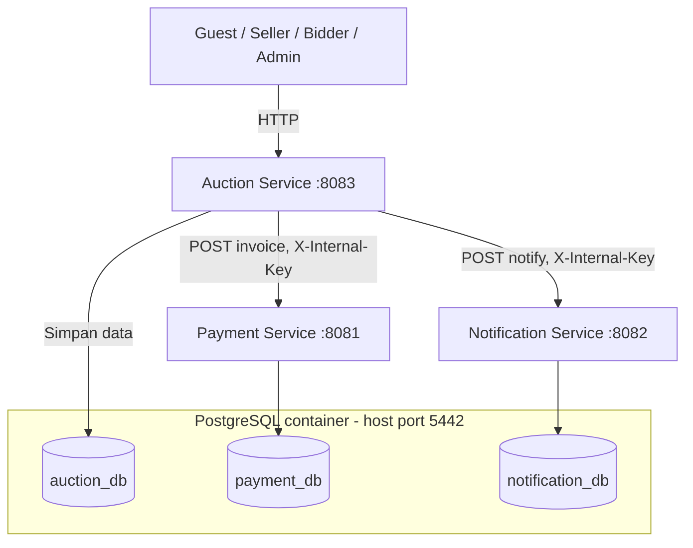

# Rumah-Lelang — Microservices Auction Platform

Platform lelang online berbasis Spring Boot, dipecah menjadi tiga microservice
independen yang saling berkomunikasi lewat HTTP dengan autentikasi internal.

---

## 1. Ringkasan Service

| Service | JAR | Port | Database | Tanggung jawab |
|---|---|---:|---|---|
| **Auction** | `auction-service-1.0.0.jar` | 8083 | `auction_db` | User, kategori, item, bid, scheduler, laporan |
| **Payment** | `payment-service-1.0.0.jar` | 8081 | `payment_db` | Invoice dan status pembayaran |
| **Notification** | `notification-service-1.0.0.jar` | 8082 | `notification_db` | Event outbid, winner, dan auction ended |

**Prinsip pemisahan data**: Payment dan Notification **tidak** punya foreign key ke
database Auction — keduanya hanya menyimpan `itemId` / `winnerId` / `userId`
sebagai *remote ID* referensi. Tidak ada repository atau entity yang lintas
service.

> Folder `legacy-single-app` adalah arsip monolith sebelum pemisahan. Folder ini
> **tidak** terdaftar sebagai Maven module dan tidak ikut dibangun. Source aktif
> hanya ada di tiga folder service di atas.

---

## 2. Arsitektur

Auction Service adalah satu-satunya pintu masuk untuk pengguna. Ia memanggil
Payment dan Notification secara internal saat lelang ditutup.



Saat menggunakan Docker Compose, ketiga database berada dalam **satu**
container PostgreSQL bernama `postgres` — tetap tiga database berbeda dalam
satu instance. Port internal tetap `5432`, dipublikasikan ke host sebagai
`localhost:5442` agar tidak konflik dengan PostgreSQL lokal.

### Alur penutupan lelang

Bagian paling kritis dari sistem, karena melibatkan tiga service secara
berurutan:

1. **Seller** membuat item lelang di Auction Service
2. **Bidder** memasang bid — divalidasi harus lebih tinggi dari bid sebelumnya
3. **Scheduler** (otomatis) atau **Admin** (manual) menutup lelang
4. **Auction Service** memilih bid tertinggi sebagai pemenang
5. Auction Service memanggil **Payment Service** untuk membuat invoice
6. Auction Service memanggil **Notification Service** untuk menyimpan info ke pemenang dan seller

```text
client → auction-service:8083
           │
           ├─ POST /api/invoices        (X-Internal-Key) → payment-service:8081 → payment_db
           ├─ POST /api/notify/*        (X-Internal-Key) → notification-service:8082 → notification_db
           └─ simpan data lelang → auction_db
```

**Penanganan kegagalan**: jika Payment Service tidak tersedia saat lelang
ditutup, proses penutupan gagal dan scheduler akan mencoba lagi pada siklus
berikutnya. Pembuatan invoice bersifat **idempoten** berdasarkan `itemId`,
begitu juga notifikasi — sehingga event tidak diam-diam hilang meski di-retry.

> Sistem ini belum memakai message broker/outbox. Rencana pengembangan lanjutan:
> transactional outbox di Auction Service + consumer idempoten di
> Payment/Notification.

---

## 3. Keamanan & Komunikasi Antar-Service

- Setiap request service-to-service wajib membawa header `X-Internal-Key` —
  request dengan key salah akan ditolak.
- JWT ditandatangani oleh Auction Service, lalu **diverifikasi ulang** oleh
  Payment dan Notification. Dengan begitu, pemenang lelang bisa membayar invoice
  dan melihat riwayat notifikasi tanpa perlu database user disalin ke service
  lain.
- Ketiga proses **wajib** memakai `JWT_SECRET` yang sama. Untuk production,
  `INTERNAL_API_KEY` juga wajib sama di ketiganya. **Jangan gunakan nilai
  default** di environment production.

---

## 4. Build & Menjalankan

**Prasyarat**: Java 17+, Maven 3.9+.

```powershell
mvn clean package
```

Hasil build:

```text
auction-service/target/auction-service-1.0.0.jar
payment-service/target/payment-service-1.0.0.jar
notification-service/target/notification-service-1.0.0.jar
```

### Opsi A — Jalankan lokal dengan H2

Urutan penting: jalankan Payment dan Notification **sebelum** Auction.

```powershell
java -jar payment-service/target/payment-service-1.0.0.jar
java -jar notification-service/target/notification-service-1.0.0.jar
java -jar auction-service/target/auction-service-1.0.0.jar
```

### Opsi B — Jalankan stack lengkap dengan PostgreSQL (Docker Compose)

```powershell
Copy-Item .env.example .env
docker compose up --build
```

### Koneksi DBeaver ke PostgreSQL

| Field | Nilai |
|---|---|
| Host | `localhost` |
| Port | `5442` |
| User / password | dari `POSTGRES_USER` / `POSTGRES_PASSWORD` di `.env` |
| Database | `auction_db`, `payment_db`, atau `notification_db` |

> Script `docker/postgres/init/01-create-databases.sql` membuat ketiga database
> saat volume PostgreSQL pertama kali diinisialisasi. **Jangan ubah atau hapus**
> script ini jika volume sudah berisi data yang ingin dipertahankan.

---

## 5. Endpoint API

### Auction Service (`:8083`)
Menangani `/api/auth`, `/api/categories`, `/api/items`, `/api/reports`.
Swagger UI hanya tersedia di service ini:
`http://localhost:8083/swagger-ui/index.html`

### Payment Service (`:8081`)

| Method | Endpoint | Akses |
|---|---|---|
| `POST` | `/api/invoices` | Internal (`X-Internal-Key`) |
| `GET` | `/api/invoices/{id}` | Token pemenang atau ADMIN |
| `PATCH` | `/api/invoices/{id}/pay` | Token pemenang atau ADMIN |

### Notification Service (`:8082`)

| Method | Endpoint | Akses |
|---|---|---|
| `POST` | `/api/notify/outbid` \| `/winner` \| `/ended` | Internal |
| `GET` | `/api/notify/history/{userId}` | Token pemilik atau ADMIN |

Health check tiap service tersedia di `/actuator/health`.

---

## 6. Pengujian

`auction-service` memiliki:
- Unit test validasi kenaikan bid
- Integration test HTTP: register → buat item → bid

```powershell
mvn -pl auction-service test
```

> Test tidak menghubungi Payment/Notification service karena alur pengujian
> belum sampai menutup lelang.

---

## 7. Postman Collection

Tersedia di folder `postman/`:

| File | Isi |
|---|---|
| `Rumah-Lelang.postman_collection.json` | Request end-to-end; token & ID tersimpan otomatis sebagai collection variable |
| `Rumah-Lelang.local.postman_environment.json` | Base URL untuk Docker lokal |
| `sample-payloads.json` | Payload contoh untuk referensi cepat |

Jalankan berurutan: `1. Auth` → `2. Auction Catalog` → `3. Bidding and Closing`.
Petunjuk lengkap ada di `postman/README.md`.

---

## 8. Batasan & Rencana Selanjutnya

- Belum memakai message broker atau pola outbox — komunikasi antar-service
  masih sinkron via HTTP.
- Rencana peningkatan ketahanan produksi: **transactional outbox** di Auction
  Service + **consumer idempoten** di Payment/Notification, agar event tidak
  bergantung pada ketersediaan service secara real-time.